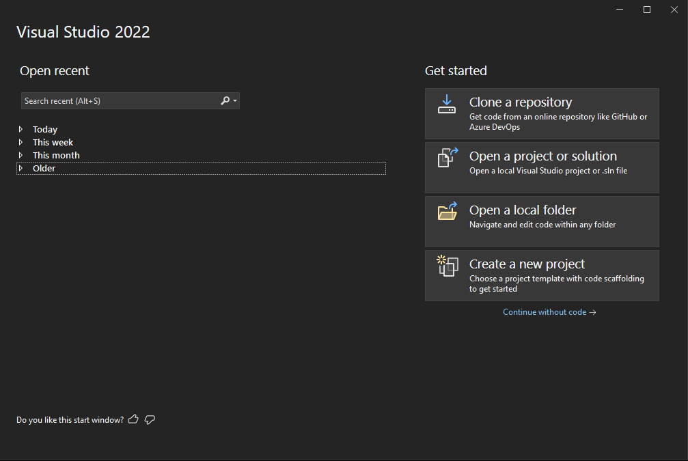
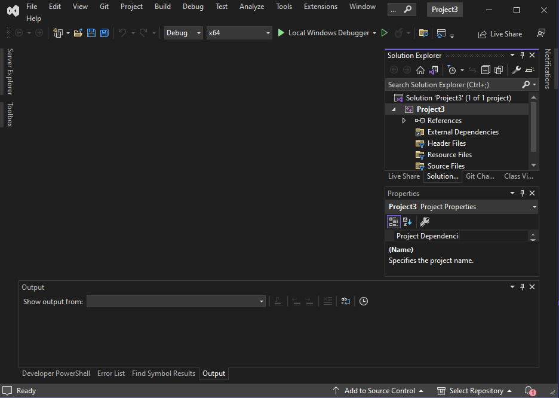
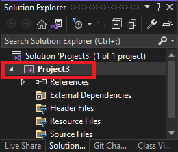
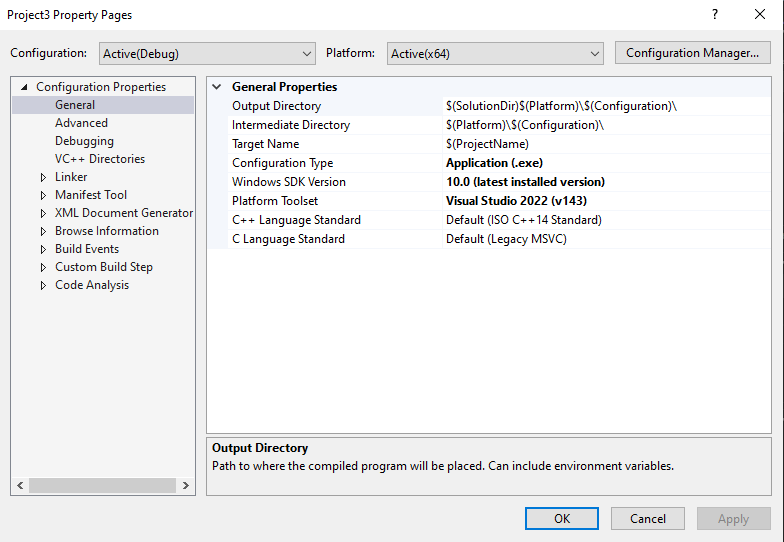

<!-- Converted from AsciiDoc to MarkDown with DownDoc -->

# CSD1401 - Visual Studio Setup for CProcessing

## Prerequisites

* Installed Visual Studio 2022 Community Edition. If you haven’t, here are the steps to set it up:
    * Click [here](https://visualstudio.microsoft.com/thank-you-downloading-visual-studio/?sku=Community&rel=16) to download the Visual Studio 2022 installer.
    * Double-click on the installer that you downloaded.
    * When prompted check the box for **[Desktop development with C++]** under the **[Desktop and Mobile]** section
    * Click the on **[Install/Modify]** button.
* Downloaded the `CProcessingSG.zip` zip file from the Moodle link `CProcessing Library`.
* Downloaded the `cp_vs2022_handout.zip` zip file from the Moodle link `CProcessing Setup for Visual Studio 2022 Handout`. It should contain:
    * `cp_vs2022_setup.html`: This document as an offline HTML.
    * `DigiPen_Singapore_WEB_RED.png`: A simple PNG image file for us to us
    * `main.c`: Sample C code that will use CProcessing code to spawn a window and render `DigiPen_Singapore_WEB_RED.png` onto it.

## Project Creation

First, we will create the Visual Studio Solution and Project files that will be used to run our first application.

* Open Visual Studio. You should see a window that looks like this:

* Under the **[Visual Studio 2022]** window:
    * Click on **[Create a new project]**
* Under the **[Create a new project]** window:
    * Click on **[Empty Project]**. Make sure that it’s the C++ version. 
    * Click on **[Next]**.
* Under the **[Configure your new project]** page:
    * (Optional) Change the **[Project Name]** to one of your liking.
    * (Optional) Change the **[Location]**.
    * Note the **[Location]** as we need to navigate to it later.
    * Click on **[Create]**.

You should see Visual Studio appear on your screen, like so:

This means that it has successfully created and opened.

In this project, we will not be building for 32-bit systems, so to avoid confusion, we need to remove 32-bit system-related configurations from the project.

*	Under [Build] > [Configuration Manager] 
* Click on [Active Solution Platform] > [Edit…] > Click on [x86] > [Remove]
* Click on [Platform] > [Edit…] > Click on [Win32] > [Remove]

## Adding a folder for CProcessing and assets

Next, we will add the CProcessing library to a location within the project folder. 
This is so that our project can easily locate CProcessing’s header and library files, and subsequently use its code.

* Go to the project’s Solution File (.sln) using Windows Explorer. It should be at the [Location] that you set earlier.
* Create a folder named "Extern" at that location. Extern is short for "External" which means that this folder will contain code that is provided by someone else.
    * Copy the CProcessing folder from the given `CProcessingSG.zip` file into the "Extern" folder.
    *	Create a folder named "Assets" at that location.
        *	Copy the given `DigiPen_Singapore_WEB_RED.png` file into the "Assets" folder you just created

## Project Configuration

Next, we configure the project properties. 
Right-click on the project in the Solution Explorer:

Then click on [Properties]. 
It should open a window that looks something like this:

This window contains all configurations of the project.

**❗ IMPORTANT**\
From here on, unless stated otherwise, all the settings we will make will affect both Debug and Release configurations, so make sure to set [Configurations] to **All Configurations**.

Add the additional directories the compiler needs to look for when compiling and linking:

*	Under [Configuration Properties] > [VC++ Directories]
    *	Add `$(SolutionDir)Extern\CProcessing\inc` to [General] > [Include Directories]
    *	Add `$(SolutionDir)Extern\CProcessing\lib\x64` to [General] > [Library Directories]

**⚠️ WARNING**\
When you add an entry into a section, you have to seperate each entry with ';'. 
For example, if the entry for [Include Directories] is: `$(VC_IncludePath);$(WindowsSDK_IncludePath)`, to add `$(SolutionDir)Extern\CProcessing\inc`, you will have to do: `$(VC_IncludePath);$(WindowsSDK_IncludePath);$(SolutionDir)Extern\CProcessing\inc`

Configure the linker to link to the appropriate CProcessing library files depending on whether we are on Debug or Release configurations:

*	Under [Configuration Properties] > [Linker] > [Input] > [Additional Dependencies]
    * With [Configuration] set to **Debug**, add `CProcessingd.lib`
    * With [Configuration] set to **Release**, add `CProcessing.lib`

Configure the character set the project is using:

*	Under [Configuration Properties] > [Advanced] > [Character Set]
    * Set to **Use Multibyte Set**

Configure the subsystem the project is using:

*	Under [Configuration Properties] > [Linker] > [System] > [Subsystem]
    *	Set to **Windows (/SUBSYSTEM:WINDOWS)**

Set the output directory of the compiler where the executable will be created. 
We will set this to a folder named **bin** at the directory the Solution file is in:

*	Under [Configuration Properties] > [General] > [Output Directory]
    *	Set to `$(SolutionDir)\bin\$(Configuration)-$(Platform)\`

Set the intermediate directory of the compiler. 
This is where all the 'rubbish' files that the compiler generates will go to.  
We will set this to a folder named ".tmp" at the directory the Solution file is in:

*	Under [Configuration Properties] > [General] > [Intermediate Directory]
** Set to `$(SolutionDir)\.tmp\$(Configuration)-$(Platform)\`

Set the working directory of the debugger to be in the same directory as the executables output by the compiler:

*	Under [Configuration Properties] > [Debugging] > [Working Directory]
** Set to `$(SolutionDir)\bin\$(Configuration)-$(Platform)\`

Configure the entry point to comply with CProcessing’s entry point:

* Under [Configuration Properties] > [Linker] > [Advanced] > [Entry Point]
  * Set to `mainCRTStartup`

Tell Visual Studio to copy the appropriate .dll and assets to where the executable is after it’s done building:

* With [Configuration] set to **Debug**:
    * Go to [Configuration Properties] -> [Build Events] > [Post-Build Event] > [Command Line] > Click on the [v] icon at the end of the [Command Line] entry area > [Edit...] and add the following lines in the popup window:
      *	`xcopy "$(SolutionDir)Assets\*" "$(OutDir)Assets\" /s /r /y /q`
      *	`xcopy "$(SolutionDir)Extern\CProcessing\lib\x64\CProcessingd.dll" "$(OutDir)" /s /r /y /q`
      *	`xcopy "$(SolutionDir)Extern\CProcessing\lib\x64\fmodL.dll" "$(OutDir)" /s /r /y /q`
*	With [Configuration] set to **Release**, add the following lines:
    * Go to [Configuration Properties] -> [Build Events] > [Post-Build Event] > [Command Line] > Click on the [v] icon at the end of the [Command Line] entry area > [Edit...] and add the following lines in the popup window:
        *	`xcopy "$(SolutionDir)Assets\*" "$(OutDir)Assets\" /s /r /y /q`
        *	`xcopy "$(SolutionDir)Extern\CProcessing\lib\x64\CProcessing.dll" "$(OutDir)" /s /r /y /q`
        *	`xcopy "$(SolutionDir)Extern\CProcessing\lib\x64\fmod.dll" "$(OutDir)" /s /r /y /q`

## Running our first application 

Create a fresh CPP file with the entry point function and name it "main.c"

*	[Project] > [Add New Item..] > [C++ File]
*	Copy the code from the given "main.c" into the "main.c" file that you just created.
*	Build and run the project
*	You should see a window pop up with the singapore DigiPen logo.

If you got here, congratulations! You have set up CProcessing!
